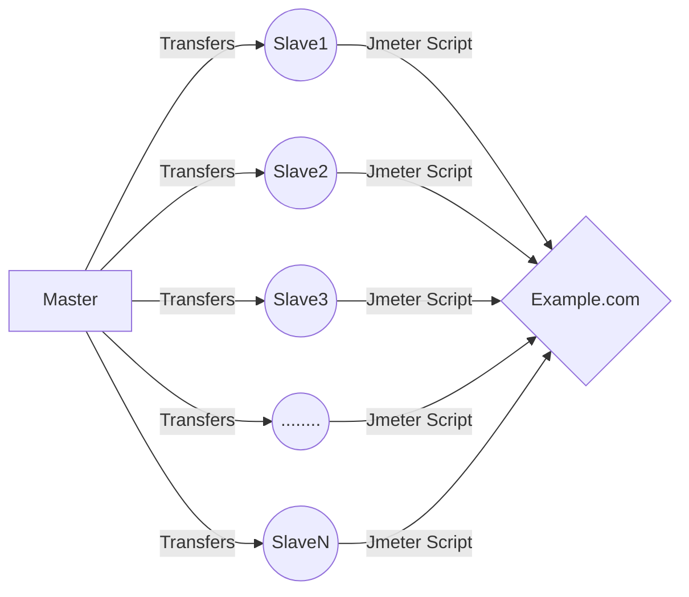

# jmeterRemote

## Apache jMeter Remote Server Python Test Script Installer &amp; Runner

This script allows you to quickly transfer your jmeter scripts to remote servers and start your tests on the remote server.

## Architecture



It connects to servers such as Azure, Amazon, AliCloud, Linode, ilkbyte via ssh.

Please select a task ?
- 1- Install
- 2- Control Installation
- 3- Start Tests
- 4- Prepare Users
- 5- Exit

## Features
- 1- Install: 
	> Installation for the remote machine requirements such as (Java Install etc...)
- 2- Control Installation:
	> It controls the uploads and file transfers. Lists incomplete installations and conditions that will prevent testing on remote machines.
- 3- Start Tests
	> Allows simultaneous initiation of testing on remote machines.
- 4- Prepare Users
	> It divides the users you have prepared for the test according to the number of machines.
- 5- Exit

## Installation

Script requires [Python](https://www.python.org/) to run.

Install the dependencies.
```sh
pip install -r requirements.txt
```

OR


```sh
pip install paramiko


import paramiko

ssh_client = paramiko.SSHClient()
ssh_client.connect(hostname, username=username, key_filename=key_filename, password=password)

```


## License

Apache License

**Free Software, Always!**
